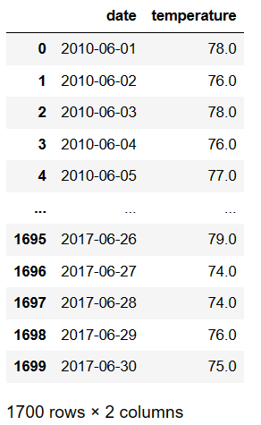
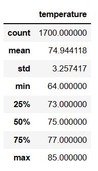
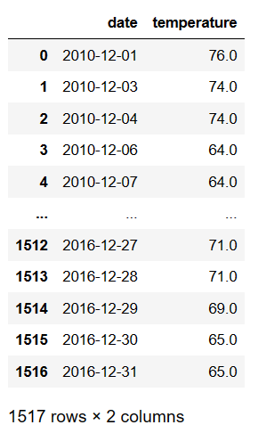
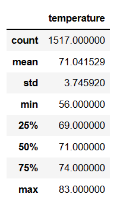

# SurfsUp Analysis 

## Overview of the Statistical Analysis

### Background

SQLite is a relational database management system contained in a C library. It is used to store and retrieve structured data from files. SQLAlchemy is the ORM of choice for working with relational databases in python. For this, both tools were used in this project to create an analysis regarding temperature trends before opening the surf shop. The goal is analyze the temperature data for the months of June and December in Oahu, inorder to determine if the surf and ice cream shop business is sustainable year-round. 

### Purpose

The main purpose of this project is provide an analysis on about temperature trends before opening the surf shop. The goal is analyze the temperature data for the months of June and December in Oahu, inorder to determine if the surf and ice cream shop business is sustainable year-round.

Using Python, Pandas functions and methods, and SQLAlchemy, it will be filtered the date column of the Measurements table in the hawaii.sqlite database to retrieve all the temperatures for the month of June and December. Also, those temperatures will be converted into a list, creating a DataFrame from the list, and generate the summary statistics for final analysis.

## SurfsUp Analysis - Results

The results were obtained through the developed of a query that filters the date column from the Measurement table to retrieve all the temperatures for the month of June and December. Then, the resuts for the month of June and December temperatures were converted into a list. The next step, included creating a DataFrame from the list of temperatures for both months. to finally generate the summary statisticsfor the temperatures DataFrame.

After the development of the code the results for temperatures for the month of June are shown below:

Then, calculating the summary statistics for the month using the function df.describe(), the results for June include:

In the same way, the results for temperatures for the month of December are shown below:

And the statistics summary for December are:

In this way, it is possible analyze the three key differences in weather between June and December as follows:

1. June (85) reflects and increment of 2.4% of max temperature compared to December (83) and a diference of 14.2% between Juner (64) and December (56).
2. The mean temperature for the month of June is 74.9 compared to 71.0 in December based on similar samples between the years of study (1,700 for June compared to 1,517 for December)
3. Standard Deviation are very similar (3.25 for June compared to 3.74 for December) obtained values clustered around the mean, and also representing different Quartile Values (Q1=73 for June compare to 69 for Dec, and Q3=77 for June compared to 74 for December)

## Summary SurfsUp Analysis 

Finally, the results showed a bigger range in temperatures for the month of December (around 27 degrees during the month compare to 21 degrees for June), with coldest valuest for the month compare with the summer weather in June. It is possible assume that temperatures are very steady bringing the opportunitty to ensure that Surf and Ice Cream Shop Business are sustainable year round based on the data studied. It is recomended complete the same analysis for based on quarters for the month of March, and October in order to have a whole vision for the complete year based on the data collected. 

In addition, it is possible propose two additional queries to perform more analysis about the weather.

1. Study of the precipitation for both months in order to compare the weather and the possible impact for the Ice Cream Business and the Surf Shop. More precipitation could generate a decrease in Ice Cream Sales and maybe and increment in the waves and Surf Shops Sales. For this, the code propose include 

        results_Prec_Dec = session.query(Measurement.date, Measurement.prcp).filter(extract('month',Measurement.date)==12).all()

        results_Prec_Dec = session.query(Measurement.date, Measurement.prcp).filter(extract('month',Measurement.date)==12).all()

2. Develop a function called 'calc_temps' that will accept start date and end date in the format '%Y-%m-%d' and return the minimum, average, and maximum temperatures for specific of dates in order to define temperature rates for specific weeks during the month of study, having a good reference for special promotions or activities in both business using the data as reference previous years in the data. Also, the results could be plot in order to have a graphical representation of the values using the code below:

    import matplotlib.pyplot as plt

    def calc_temps(start_date, end_date):

        return session.query(func.min(Measurement.tobs), func.avg(Measurement.tobs), func.max(Measurement.tobs)).\ 
        filter(Measurement.date >= start_date).filter(Measurement.date <= end_date).all()

        start_date = '2017-12-2'
        end_date = '2017-12-12'
        date_range = start_date + ' - ' + end_date
        tmin,tavg,tmax = calc_temps(start_date, end_date)[0]
        tavg_df=pd.DataFrame([tavg],columns=['tavg'],index=[date_range])

        tavg_df.plot(kind='bar',yerr=[[tavg-tmin],[tmax-tavg]])
        plt.xticks(rotation='horizontal')
        plt.ylabel('Temperature (degrees Farenheit)')
        plt.title('Trip Average Temperature')
        plt.show()

